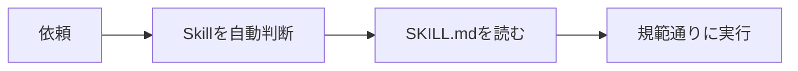
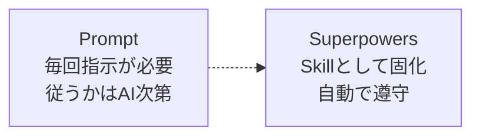
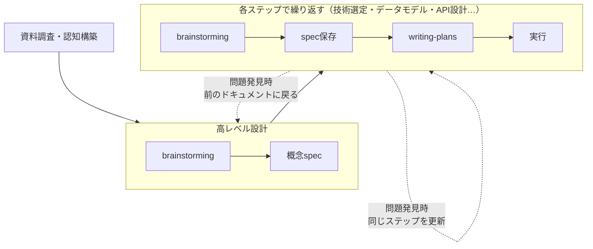

# Superpowers Skills 紹介

## 1. Skillとは何か

操作規範を書いたMarkdownファイル。Agentがタスク前に自動判断して読み込み、従う。

## 2. Superpowersとは何か

AIの「能力」ではなく「行動」を制御するSkillのコレクション。Promptで毎回伝えなくても、Claudeが自律的に遵守する。

**主なSkill：**

| Skill | 内容 |
|---|---|
| brainstorming | 要件を明確化し、specとして保存 |
| writing-plans | specをタスクに分解 |
| subagent-driven-development | タスクごとにagentを分離 |
| test-driven-development | テストなしのコードは削除してやり直し |

## 3. 私の使い方

コンテキストはファイルに残る。セッションが終わっても、人が変わっても続きから始められる。