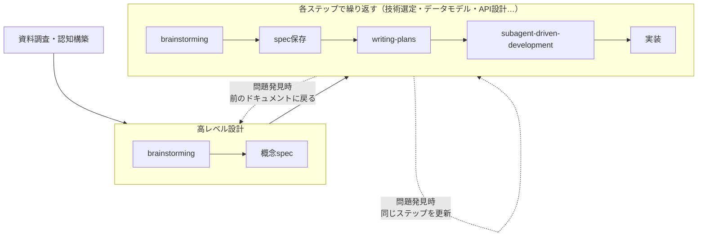

# Superpowers Skills 紹介

## 1. Skillとは何か

SkillはそのPromptを専門家レベルでまとめたMarkdownファイルです。Claudeがタスクの内容を見て自分で判断して読み込んで、その通りに動いてくれます。


## 2. Superpowersとは何か

SuperpowersはGitHubで公開されているオープンソースのSkillコレクションで、開発の各フェーズをカバーするSkillが揃っています。プロジェクトの最初や新しい機能を作るときに特に使えるものだと思っています。

**主なSkill：**

| Skill | 内容 | アウトプット |
|---|---|---|
| brainstorming | 要件を明確化し設計を固める | `docs/superpowers/specs/` にspec保存 |
| writing-plans | specをタスクに分解 | `docs/superpowers/plans/` にplan保存 |
| subagent-driven-development | タスクごとにagentを分離して実行 | 実装コード |
| test-driven-development | テストなしのコードは削除してやり直し | テスト＋実装コード |
| systematic-debugging | 根本原因を段階的に分析して解決 | 修正コード |

**インストール方法**
```bash
# claude code terminal 
/plugin install superpowers@claude-plugins-official
```


## 3. 私の使い方



コンテキストはファイルに残る。セッションが終わっても、人が変わっても続きから始められる。
